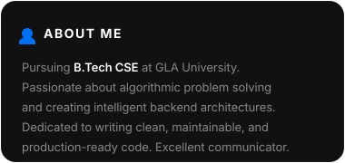
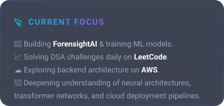
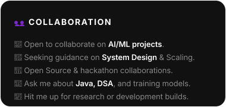
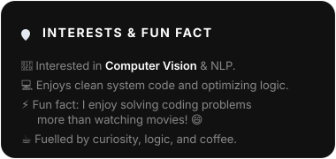
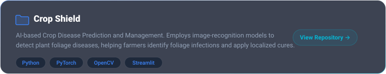
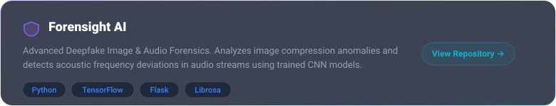
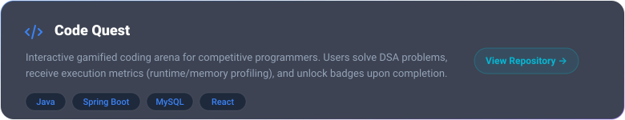
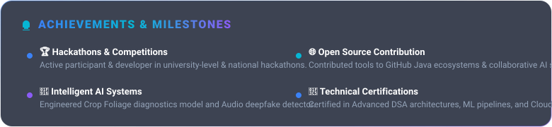

<!-- Premium Developer Landing Page README -->
<!-- Designed to emulate the design language of Apple, Vercel, Stripe, and Linear -->

  

<!-- Social Connect Pills -->

  
  
  
  
  

  

<!-- About Section Grid -->

  
  

  
  

  

<!-- Tech Stack Categories -->
<h3 align="center">🛠️ Core Technology Stack</h3>
 

  <b>Programming Languages</b> 
  

 

  <b>AI / Machine Learning &amp; Computer Vision</b> 
  

 

  <b>Backend Frameworks &amp; Databases</b> 
  

 

  <b>Frontend Library &amp; Web Essentials</b> 
  

 

  <b>Cloud, DevOps &amp; Developer Tooling</b> 
  

  

<!-- Featured Project Showcase -->
<h3 align="center">🚀 Featured Project Showcase</h3>
 

  
    
  
    
  

  

<!-- Achievements Card -->

  

  

<!-- GitHub Analytics -->
<h3 align="center">📊 Interactive Analytics &amp; Activities</h3>
 

  
  

  

<h3 align="center">🐍 Contribution Activity</h3>

  

<h3 align="center">💡 LeetCode Performance</h3>

  

 

  

<!-- Footer Wave & Sign-off -->

  

  <i>"The best way to predict the future is to invent it."</i>  
  <b>Designed &amp; Crafted with 💙 by Devansh Maheshwari</b>

